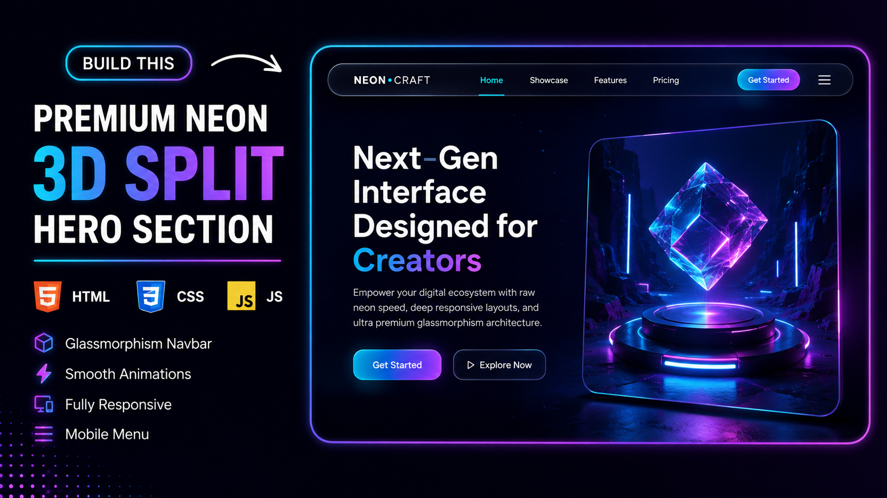

# 🚀 Neon 3D Split Hero & Navigation

A modern and premium **Neon 3D Split Hero Section** with a beautiful **Glassmorphism Navigation Bar**, built using **HTML, CSS, and JavaScript**. This project features smooth animations, responsive design, glowing UI effects, and a clean split layout—perfect for landing pages, portfolios, SaaS websites, and modern web interfaces.

---

## ✨ Features

- 🌟 Premium Glassmorphism Navigation Bar
- 🎨 Neon Gradient UI Design
- 🖱️ Smooth Hover Animations
- 📱 Fully Responsive Layout
- 🍔 Animated Mobile Navigation Menu
- 💎 Floating Hero Image Animation
- ⚡ Smooth Entrance Animations
- 🌈 Gradient Typography
- 🧩 Clean & Well-Structured Code
- 🚀 Built with Pure HTML, CSS & JavaScript

---

## 🛠️ Technologies Used

- HTML5
- CSS3
- JavaScript (Vanilla)

---

## 📂 Project Structure

```
Neon-3D-Split-Hero-Navigation/
│── index.html
│── style.css
│── script.js
│── hero-img.jpg
│── README.md
```

---

## 📸 Preview


---

## 🚀 Getting Started

1. Clone the repository

```bash
git clone https://github.com/your-username/Neon-3D-Split-Hero-Navigation.git
```

2. Open the project folder.

3. Open `index.html` in your browser.

Or simply use **Live Server** in Visual Studio Code.

---

## 🎯 Perfect For

- Landing Pages
- SaaS Websites
- Startup Websites
- Portfolio Websites
- Creative Agencies
- Modern UI Inspiration

---

## 🤝 Contributing

Contributions are welcome!

Feel free to fork this repository, improve the design, and submit a pull request.

---

## ⭐ Support

If you like this project:

⭐ Star this repository

👍 Like the YouTube video

📺 Subscribe to the channel

---

## 👨‍💻 Author

**Tinesh Chasiya**

- 🌐 Portfolio: https://design-media.netlify.app/
- 💻 GitHub: https://github.com/TineshChasiya
- 📺 YouTube: https://www.youtube.com/@DesignAndMedia-DM